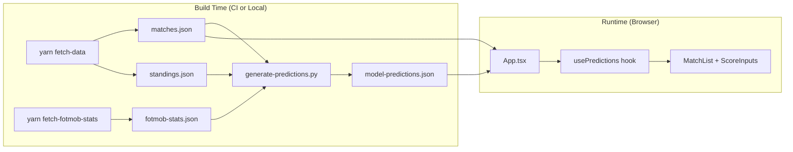

# Match Prediction Model

Add a Python-based statistical model that generates score predictions for remaining fixtures, enriched with xG data from FotMob, with a frontend button to populate all predictions from the model output.

## Architecture Overview



## Data Pipeline

The prediction model runs as part of the build pipeline, either locally during development or in GitHub Actions during deployment. The pipeline has three stages:

1. **Fetch match data** (`yarn fetch-data`) -- fetches match results and standings from football-data.org
2. **Fetch FotMob stats** (`yarn fetch-fotmob-stats`) -- fetches season-level xG and other team stats from FotMob's public CDN
3. **Generate predictions** (`yarn generate-predictions` / `python3 scripts/generate-predictions.py`) -- runs the Poisson model to produce `model-predictions.json`

All three stages run sequentially before `yarn build`, which bundles `model-predictions.json` into the static site alongside the other JSON data files.

## FotMob Data Source

### Overview

FotMob provides free, unauthenticated season-level aggregate team statistics via a public CDN. These are the same stats displayed on [fotmob.com](https://www.fotmob.com/leagues/48/stats). The data is served as gzip-compressed JSON from URLs following this pattern:

```
https://data.fotmob.com/stats/{leagueId}/season/{seasonId}/{statName}.json
```

For the EFL Championship: `leagueId = 48`. The current season ID is discovered from the league stats **HTML** page (FotMob no longer serves the old `GET /api/leagues?...&tab=stats` JSON route). The script loads `https://www.fotmob.com/leagues/{id}/stats/{seostr}` (see `fotmobStatsSeoStr` in `scripts/common.ts`), parses the embedded Next.js `__NEXT_DATA__` JSON, and reads `stats.teams[].fetchAllUrl` the same as before.

### Available team stats

All 27 team-level stats are fetched dynamically (not hardcoded). As of the 2025-26 season:

| Category   | Stat name                          | URL slug                       |
| ---------- | ---------------------------------- | ------------------------------ |
| Top Stat   | FotMob rating                      | `rating_team`                  |
| Top Stat   | Goals per match                    | `goals_team_match`             |
| Top Stat   | Goals conceded per match           | `goals_conceded_team_match`    |
| Top Stat   | Average possession                 | `possession_percentage_team`   |
| Top Stat   | Clean sheets                       | `clean_sheet_team`             |
| Top Stat   | Attendance                         | `home_attendance_team`         |
| Attacking  | Expected goals (xG)                | `expected_goals_team`          |
| Attacking  | xG difference                      | `_xg_diff_team`                |
| Attacking  | Shots on target per match          | `ontarget_scoring_att_team`    |
| Attacking  | Big chances                        | `big_chance_team`              |
| Attacking  | Big chances missed                 | `big_chance_missed_team`       |
| Attacking  | Accurate passes per match          | `accurate_pass_team`           |
| Attacking  | Accurate long balls per match      | `accurate_long_balls_team`     |
| Attacking  | Accurate crosses per match         | `accurate_cross_team`          |
| Attacking  | Penalties awarded                  | `penalty_won_team`             |
| Attacking  | Touches in opposition box          | `touches_in_opp_box_team`      |
| Attacking  | Corners                            | `corner_taken_team`            |
| Defending  | xG conceded                        | `expected_goals_conceded_team` |
| Defending  | Interceptions per match            | `interception_team`            |
| Defending  | Tackles per match                  | `total_tackle_team`            |
| Defending  | Clearances per match               | `effective_clearance_team`     |
| Defending  | Possession won final 3rd per match | `poss_won_att_3rd_team`        |
| Defending  | Penalties conceded                 | `penalty_conceded_team`        |
| Defending  | Saves per match                    | `saves_team`                   |
| Discipline | Fouls per match                    | `fk_foul_lost_team`            |
| Discipline | Yellow cards                       | `total_yel_card_team`          |
| Discipline | Red cards                          | `total_red_card_team`          |

### Response format

Each stat endpoint returns JSON in this shape:

```json
{
  "TopLists": [
    {
      "StatName": "expected_goals_team",
      "Title": "Expected goals",
      "StatList": [
        {
          "ParticipantName": "Coventry City",
          "TeamId": 8669,
          "StatValue": 64.2,
          "SubStatValue": 72.0,
          "MatchesPlayed": 35,
          "Rank": 1
        }
      ]
    }
  ],
  "LeagueName": "Championship"
}
```

`StatValue` is the stat itself (e.g. xG total); `SubStatValue` is a secondary value (typically actual goals scored); `TeamId` is FotMob's internal ID (different from football-data.org IDs).

### Team ID mapping

FotMob and football-data.org use different team IDs. The `fetch-fotmob-stats` script discovers the mapping by:

1. Using any existing `fotmobId` values already present in `teams.json`
2. For teams without a `fotmobId`, falling back to name normalization (strip FC/AFC suffixes, lowercase, compare)
3. Writing discovered FotMob IDs back to `teams.json` as a `fotmobId` field

Since `teams.json` is committed to git (not gitignored), the `fotmobId` values persist across deploys.

## Component Details

### 1. FotMob Stats Fetch Script

**File:** `scripts/fetch-fotmob-stats.ts`

A TypeScript script (consistent with existing `fetch-data.ts` / `fetch-teams.ts` patterns) that fetches all available season-level team stats from FotMob's public data CDN. No API key or authentication is required.

**Steps:**

1. Fetch the league stats HTML page and parse `__NEXT_DATA__` to discover all available stats and their `fetchAllUrl` values (same metadata FotMob used to expose via `GET /api/leagues?...&tab=stats`)
2. Fetch each stat's full data concurrently via `Promise.all`
3. Read `src/data/teams.json` to get the football-data.org team list
4. Build the FotMob-to-football-data.org team ID mapping (existing `fotmobId` values first, then name normalization fallback)
5. Write discovered `fotmobId` values back to `teams.json`
6. Write `src/data/fotmob-stats.json` keyed by football-data.org team ID

**Output format** (`src/data/fotmob-stats.json`):

```json
{
  "lastUpdated": "2026-03-03T...",
  "season": "2025-26",
  "stats": {
    "332": {
      "teamName": "Birmingham City",
      "fotmobId": 8658,
      "matchesPlayed": 35,
      "expected_goals_team": { "value": 50.5, "subValue": 46.0 },
      "expected_goals_conceded_team": { "value": 35.9, "subValue": 46.0 },
      ...
    }
  }
}
```

**Key implementation details:**

- Uses `fetch()` (available in Node 22) with `Accept-Encoding: gzip` and a browser `User-Agent` header (required by FotMob's CDN)
- Follows the same patterns as `fetch-data.ts`: ESM imports, `fs.writeFileSync`, `path.join(import.meta.dirname, ...)`, stdout logging
- Does not require `dotenv` or any API key
- Fetches all stat URLs concurrently since they are independent
- Forward-compatible: if FotMob adds new stats, they appear automatically without code changes

### 2. `fetch-teams.ts` Update

**File:** `scripts/fetch-teams.ts`

Updated to preserve `fotmobId` values when re-fetching team data from football-data.org (which knows nothing about FotMob IDs).

Before writing the new teams data, the script reads the existing `teams.json` (if it exists) and builds a `Map<number, number>` of `id` to `fotmobId`. When mapping the API response, existing `fotmobId` values are merged back in. If the file cannot be read (first run), it proceeds without them.

### 3. Python Prediction Script

**File:** `scripts/generate-predictions.py`

A standalone Python script using only the standard library (no pip dependencies). It reads `matches.json` and optionally `fotmob-stats.json` to derive team strength ratings, then generates predicted scores for all SCHEDULED fixtures.

**Model approach -- Poisson regression with xG integration:**

1. **Build team profiles from finished matches:**
   - Home/away goals for and against per game
   - Recent form (last 6 matches) with exponential decay weighting (decay factor 0.85)

2. **Compute match-derived ratings** (relative to league average, where 1.0 = average):
   - Home attack/defense ratings from home match performance
   - Away attack/defense ratings from away match performance
   - Form adjustment: 80% season average, 20% recent form

3. **Compute xG-derived ratings** from FotMob data:
   - xG-based attack strength: `team_xG_per_match / league_avg_xG_per_match`
   - xG-based defense strength: `team_xGConceded_per_match / league_avg_xGConceded_per_match`
   - Home/away split derived from league-wide home/away ratio

4. **Blend match and xG ratings:**
   - Final rating = `(1 - w) * match_rating + w * xG_rating` where `w` defaults to 0.5
   - If `fotmob-stats.json` is missing or a team lacks xG data, falls back to match-only ratings

5. **Predict each match:**
   - `lambda_home = blended_home_attack(H) * blended_away_defense(A) * league_avg_home_goals`
   - `lambda_away = blended_away_attack(A) * blended_home_defense(H) * league_avg_away_goals`
   - Lambda values clamped to `[0.3, 5.0]` range
   - Predicted score = `round(lambda)` for each team

**Usage:**

```bash
python scripts/generate-predictions.py              # default (50% xG weight)
python scripts/generate-predictions.py --xg-weight 0.6  # heavier xG weighting
python scripts/generate-predictions.py --no-xg          # match results only
```

**Output format** (matches the existing `PredictionsStore.predictions` shape):

```json
{
  "lastUpdated": "2026-03-03T...",
  "predictions": {
    "541089": { "homeGoals": 2, "awayGoals": 1 },
    "541090": { "homeGoals": 1, "awayGoals": 1 }
  }
}
```

**No external Python dependencies.** Uses only `json`, `math`, `os`, `sys`, `argparse`, and `collections` from stdlib.

### 4. Frontend Integration

**Types** (`src/types/index.ts`):

Added `ModelPredictionsData` interface:

```typescript
export interface ModelPredictionsData {
  lastUpdated: string;
  predictions: Record<string, { homeGoals: number; awayGoals: number }>;
}
```

**Predictions hook** (`src/hooks/usePredictions.ts`):

Added `fillFromModel()` method that batch-sets all model predictions into the store, replacing any existing user predictions:

```typescript
const fillFromModel = useCallback(
  (modelPredictions: Record<string, { homeGoals: number; awayGoals: number }>) => {
    setPredictions({
      predictions: { ...modelPredictions },
      lastModified: new Date().toISOString(),
    });
  },
  [],
);
```

**App component** (`src/App.tsx`):

- Imports `model-predictions.json` at module level alongside other data files
- Casts it as `ModelPredictionsData` and extracts the `predictions` record
- Destructures `fillFromModel` from `usePredictions`
- Adds a "Use Model Predictions" button (variant: `success`) in the fixtures panel header, alongside the existing "Reset Predictions" button
- "Reset Predictions" keeps its current behavior (clears all predictions to empty)
- "Use Model Predictions" replaces all current predictions with the model's output

### 5. CI/CD Updates

**File:** `.github/workflows/deploy.yml`

Added three steps between `yarn install` and `yarn build`:

1. `actions/setup-python@v5` with `python-version: '3.12'`
2. `yarn fetch-fotmob-stats` (no secrets required)
3. `python scripts/generate-predictions.py`

No `pip install` step is needed since the Python script uses only stdlib.

### 6. Developer Experience

**npm scripts** added to `package.json`:

- `"fetch-fotmob-stats": "tsx scripts/fetch-fotmob-stats.ts"`
- `"generate-predictions": "python3 scripts/generate-predictions.py"`

**`.gitignore`** additions:

- `src/data/fotmob-stats.json`
- `src/data/model-predictions.json`

Both scripts print summaries to stdout for debugging.

## Key Design Decisions

- **FotMob data CDN as xG source**: Free, unauthenticated, stable CDN (`data.fotmob.com`) that provides season-aggregate xG for all Championship teams. No API key or paid subscription required.
- **Fetch all stats dynamically**: The script discovers available stats from the league endpoint rather than hardcoding a subset. Forward-compatible if FotMob adds or removes stats.
- **Team ID mapping by name normalization, persisted as `fotmobId`**: Rather than hardcoding a brittle ID-to-ID map, the script normalizes team names and matches them. Once discovered, the FotMob ID is written to `teams.json` so it persists across deploys.
- **`fetch-teams.ts` preserves `fotmobId`**: Since the Football Data API doesn't know about FotMob IDs, the fetch-teams script reads the existing `teams.json` before overwriting and merges `fotmobId` values back in.
- **Graceful degradation**: If `fotmob-stats.json` is missing or incomplete, the prediction script falls back to match-only ratings. The build never fails due to FotMob being unavailable.
- **No external Python dependencies**: The Poisson model uses only stdlib `math` functions. This keeps CI simple -- no `requirements.txt`, `pip install`, or virtualenv step.
- **Deterministic output**: Using `round(lambda)` rather than random sampling means the same input data always produces the same predictions. No seed management needed.
- **Opt-in UX**: Model predictions are available but not forced on the user. They must explicitly click "Use Model Predictions" to populate the fixtures.
- **Blended xG weighting**: The 50/50 default blend of match-derived and xG-derived ratings balances actual results against underlying quality. The weight is configurable via `--xg-weight`.

## Implementation Steps Performed

### Step 1: Create `scripts/fetch-fotmob-stats.ts`

Created the TypeScript script to fetch all 27 team stat categories from FotMob's public data CDN. The script:

- Discovers available stats dynamically from the league endpoint
- Fetches all stat URLs concurrently via `Promise.all`
- Maps FotMob team IDs to football-data.org IDs using existing `fotmobId` values from `teams.json`, with name normalization fallback
- Writes discovered `fotmobId` values back to `teams.json`
- Writes the full stats dataset to `src/data/fotmob-stats.json`

Tested locally: successfully fetched stats for all 24 teams across 27 categories.

### Step 2: Update `scripts/fetch-teams.ts`

Modified the fetch-teams script to read the existing `teams.json` before overwriting, building a `Map<number, number>` of team ID to FotMob ID. When writing the new file, existing `fotmobId` values are merged back into each team object using a conditional spread.

### Step 3: Create `scripts/generate-predictions.py`

Created the Python prediction script implementing a Poisson regression model. Initial implementation used the Poisson mode (`floor(lambda)`) for score selection, but this produced overly concentrated results (mostly 1-0 and 1-1 scores, which while statistically correct for the most common single scoreline, lacked variety).

Refined the approach to use `round(lambda)` which produces better-distributed predictions. With the current data (as of GW35):

- **Score distribution**: 1-1 (57), 2-1 (53), 1-2 (15), 2-2 (6), 3-1 (1), 1-3 (1), 3-0 (1), 2-0 (1)
- **Outcomes**: 56 home wins, 63 draws, 16 away wins
- **Average predicted score**: 1.5 - 1.2 (close to league averages of 1.39 - 1.20)

### Step 4: Update `.gitignore`

Added `src/data/model-predictions.json` alongside the already-present `src/data/fotmob-stats.json`. Updated the comment to reflect the broader scope of generated files.

### Step 5: Add `ModelPredictionsData` type

Added the interface to `src/types/index.ts` matching the output format of `model-predictions.json`.

### Step 6: Add `fillFromModel()` to `usePredictions` hook

Added the `fillFromModel` method that accepts a model predictions record and batch-sets it as the entire predictions store. Exposed it in the hook's return value.

### Step 7: Integrate into `App.tsx`

- Imported `model-predictions.json` as `modelPredictionsData`
- Cast and extracted the `predictions` record at module level
- Destructured `fillFromModel` from `usePredictions`
- Added a "Use Model Predictions" button (variant: `success`) in the fixtures panel header, always visible alongside the conditional "Reset Predictions" button

### Step 8: Add npm scripts

Added two scripts to `package.json`:

- `fetch-fotmob-stats` -- runs the TypeScript FotMob stats fetcher via `tsx`
- `generate-predictions` -- runs the Python prediction generator

### Step 9: Update deploy workflow

Added three steps to `.github/workflows/deploy.yml`:

1. `actions/setup-python@v5` with Python 3.12 (placed after Node setup, before install)
2. `yarn fetch-fotmob-stats` (after `yarn fetch-data`)
3. `python scripts/generate-predictions.py` (after FotMob stats fetch, before `yarn build`)

### Verification

Ran a full `yarn build` locally to confirm TypeScript compilation and Vite bundling succeed with all new data files and type changes in place.
